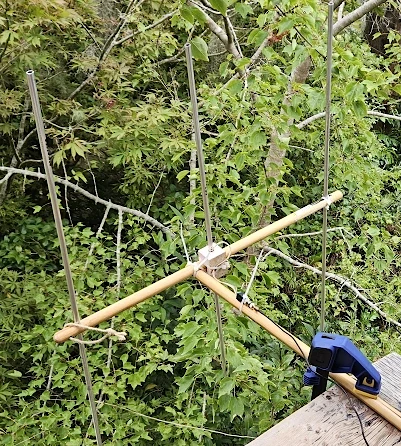
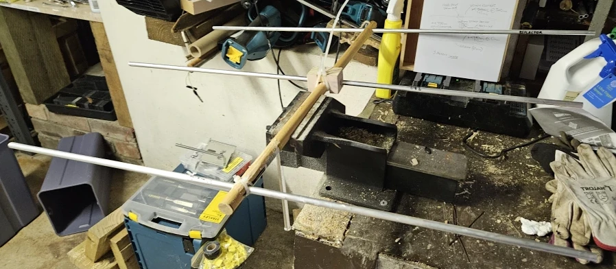

# 2m Broomstick Yagi

This 2m Broomstick Yagi Antenna was created from cheap components found at the local hardware store.

## Bill of materials

### Purchased
 * 3x 1m long x 10mm diameter x 1mm thick aluminium rods
 * 1x spare broom handle

Total cost: Around AUD$15

### Scrounged

 * Small block of wood
 * Some kind of short feed line
 * Short length of decent quality copper or aluminium scrap wire (I used speaker wire)
 * Any type of converter from scrap wire to feed line (SMA or BNC), soldered or purchased screw terminal type

### Tools required

 * 1 x Drill
 * 1 x 10mm drill bit
 * 1 x 2.5mm drill bit
 * 2 x M3 screws
 * 1 x Some kind of saw
 * 1 x Superglue
 * ~20 x Zipties

### Optional tools (preferable)

 * 1 x Bench vise
 * 1 x Duct tape
## Construction

 1. Cut the broom stick to length (just over 75cm). Keep the off-cut, we will use it later.
 2. Drill parallel 10mm holes at the following points:
   * Zero point (a few mm in from one end) - this will be the reflector
   * Driven element point (305mm in from the zero point)
   * Director point (710mm from the zero point)
 3. Insert the various elements and check parallelism. If the parallelism is insufficient, modify the holes until obtained.
 4. Cut the various elements to length. Nominal lengths are:
   * Driven element (2 pieces, each at )
   * Reflector (1 piece of )
   * Director (1 piece of )
 5. Now comes the hard part. Make a 'U' shaped block of wood with which to allow the two driven elements to be inserted around but not inside of the driven element point.
 6. Zip tie the driven element mounting block in place and superglue it.
 7. Mark points very close to the driven element emerges from the mounting block and drill holes through at 2.5mm 
 8. Take M3 washers and M3 screws and screw them through to create attachment points.
 9. Cut your scrap wire to length, strip the ends, twist the ends, then curve in to a 'J' shape at the end and nest beneath the washers before screwing down tightly.
 10. If you wish, optionally duct tape over this to provide weather sealing.
 11. Cut a 'U' out of the end of the spare piece of broom stick to facilitate 90 degree mounting.
 12. Zip tie in place.
 13. Zip tie the wires to provide strain relief on the feed.
 14. Zip tie the feed line along the extra broom stick to provide parallel feed. For a possible benefit to the feed, depending on how long it is and how RF-superstitious you are, you can spin some wire around the broomstick a few times to make a nominal air coil and zip-tie the termination so that it stays tight and parallel.

## Result

After a shopping trip and about 1 hour of total work I was able to use the antenna to receive the [local HADARC net at 147.250MHz](https://www.hadarc.org.au/nets.html) very clearly. Certainly much clearer than the two monopoles I had on hand.

This was a nice surprise as the VNA's SWR reading said that the monopoles had lower SWR at the target frequency and this was about 20MHz lower than the designed target

Transmit was received and understood but allegedly not a good quality signal, this is probably due to one of the following factors:
 * The transmit path may not have been well aligned with the target.
 * The receive path may have bounced off something.
 * The aerial was not mounted very high from the ground.
 * The UV5R radio possibly has a low quality mic and input filtering and might thus require high input volume for successful audio encoding.
 * The antenna was mounted low and trying to transmit through a mountain (ie. no line of sight).

## Future work

 * Figure out if the antenna's frequency can be brought up to the target frequency (probably requires some metalwork to shorten the elements)
 * Figure out if the transmit can be improved somehow, possibly by reducing issues on the feed line by adding a proper choke or balun for impedance matching
 * Figure out if grounding the antenna somehow may be beneficial (neither the radio nor the antenna system was grounded)
 * Figure out if raising the antenna to a higher position is feasible (this will require a longer feed line an an alternate mounting arrangement)
